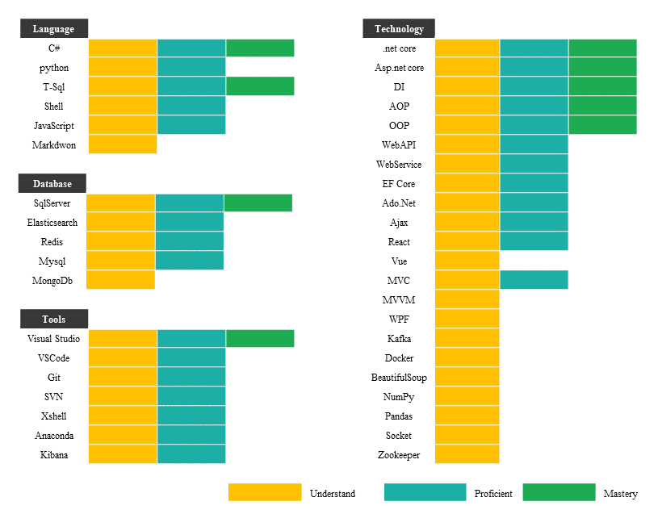

Personal Information

---

* I am David, a software development engineer residing in Chengdu. I graduated from Chengdu University of Information Technology with a major in Software Engineering.

Skills
------

Education
---------

2015.09-2019.06
Bachelor's degree in Software Engineering, Chengdu University of Information Technology
Courses studied: computer networks, C++, Python, .Net, software engineering
Achievements: received CET6 certificate and scholarship

Work Experience
---------------

2019.04-2019.10C# backend development engineer, Chengdu Renwoxing Co., Ltd.

* Developed web-based systems for ERP software related reports, printing, process control, and warehouse management
* Developed complex stored procedures for SQL Server databases and used the .NET WPF framework
* Implemented output display and joint querying of tablet application reports

2019.10-2021.12Software development engineer, Chengdu Shensike Technology Co., Ltd.

* Completed various crawler projects, including data cleaning and storage
* Developed Twitter, Facebook, and 189 email scrapers using Python and .NET/.NET Core
* Cooperated with third-party companies to transmit and parse data through sockets, JSON, XML, etc.
* Implemented project cross-platform applications (domestication of foreign-developed software) using .NET5

2021.12-presentBackend development engineer at Beisen Cloud Computing

* Develop microservices to integrate recruitment cloud business operations with different clients
* Cooperate with third-party companies to implement data encryption transmission and RESTful interactions
* Complete form organization and identity authority control
* Coordinate with large customers (Starbucks, Neusoft, etc.) for recruitment ERP business interconnection

Project Experience
------------------

### C# backend development engineer, Chengdu Renwoxing Co., Ltd.

2019.04-2019.10

* Guanjiapo C/S project: Used the .NET WPF framework and SQL Server database, developed complex SQL operations (multiple table statistics, multiple table queries, etc.)
* Guanjiapo PAD side project: used Pascal language to develop interfaces, and displayed PDF data on the PAD side

### Software development engineer, Chengdu Shensike Technology Co., Ltd.

2019.10-2019.11

* Technical Investigation Platform of Public Security: wrote scrapers for Twitter, Facebook, 163 and other websites using Python, with technical tools including beautifulSoup, SQLite, MQ message queue, and deepened understanding of HTTP, TCP protocols2019.11-2021.12
* Data processing of a certain public security technical investigation platform: used C# to process various kinds of data such as JSON, XML, PCAP, DOCX, Excel, video and audio, and wrote script deployment programs that support Windows and Linux. Familiar with multithreaded development process, reflection, Linq queries, serialization, and established socket or http connections with third-party platforms
* Data entry into SQL Server data (relational data) and ES (non-relational data) for various crawler data and host data.2021.06-2021.12
* Cross-platform database processing of a certain public security technical investigation platform: using .NET5 console program development, running environment supports Windows and China Standard Dragon system.

### Backend development engineer at Beisen Cloud Computing

2021.12-present

* Customized development of recruitment management cloud system and third-party docking
* AOP development, realizes triggers according to different functions, and solves problems from an aspect-oriented perspective
* SaaS software development uses PaaS platform services to
